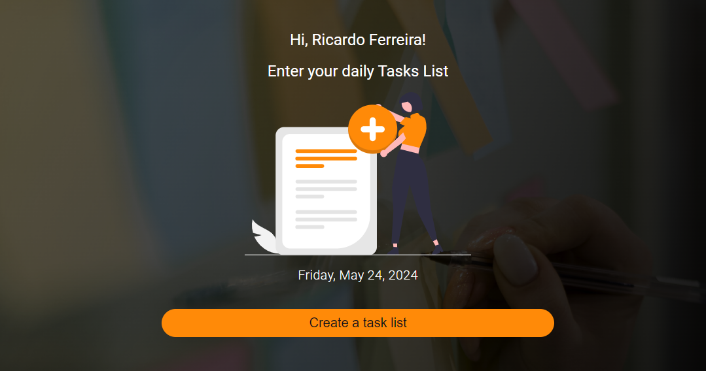

# task-list - Manage your daily tasks
This is a simple personal app to add small remainders of the tasks you have to tackle every single day. Simply writen dow a quick note about a task, add it to a list and you're done. It is implemented
like a FIFO (First In First Out), using Angulat 17+ as the frontend framework to practice new skills. 
The idea is just to have an easy and quick remainder of the tasks completed and to be completed at the end of the day, without any of the common burden of other apps. The goal is to have an easy online tool to quicky write down my tasks and no longer using Post-it all over the place.
The roadmap of new features will be as follows:

## _Roadmap of Future App Features_ 
 - URL: https://todo-list.ferreiras.dev.br
 - Timestamp of each task indicating start and end time.
 - Autentication based on Argon2 and Pepper with notification being sent to a registered email
 - Usage of localStorage or Firebase to allow history pagination of tasks completed or !completed
 - Calendar + agenda to allow schedule tasks days ahead
 - Notification of tasks to be done along the day.

## _Table of contents_
- [task-list - Manage your daily tasks](#task-list---manage-your-daily-tasks)
  - [_Roadmap of Future App Features_](#roadmap-of-future-app-features)
  - [_Table of contents_](#table-of-contents)
  - [_Overview_](#overview)
  - [_Screenshot_](#screenshot)
  - [_Links_](#links)
  - [_Built with_](#built-with)
  - [_What I practiced_](#what-i-practiced)
  - [_Continued development_](#continued-development)
    - [_Useful resources_](#useful-resources)
  - [_Author_](#author)
  - [Acknowledgments](#acknowledgments)
## _Overview_
The design is structured as shown:
- src|
  - app |
     - modules |
     - to-do-list |
       -  components |
          -   date-pipe
          -   input-add-item
          -   input-list-items
        -  enum
        -  interface
        -  pages 
  - assets |
  - scss|
    - base
    -  components
    -  layout
    -  theme
  - _index.scss
- index.html
- main.ts
- styles.css 

## _Screenshot_
[](https://todo-list.ferreiras.dev.br)
## _Links_
- Live Site URL: [https://todo-list.ferreiras.dev.br] 
## _Built with_
[](https://skillicons.dev)

 ## _What I practiced_
``` tsx
import {
  ChangeDetectorRef,
  Component,
  ElementRef,
  EventEmitter,
  Input,
  Output,
  ViewChild,
  inject,
} from '@angular/core';

// Interfaces
import { NgClass } from '@angular/common';
import { IListItems } from '../../interface/IListItems.interface';
import { DatePipeComponent } from "../date-pipe/date-pipe.component";

@Component({
    selector: 'app-input-add-item',
    standalone: true,
    templateUrl: './input-add-item.component.html',
    styleUrl: './input-add-item.component.scss',
    imports: [NgClass, DatePipeComponent]
})
export class InputAddItemComponent {
  #cdr = inject(ChangeDetectorRef);

  @ViewChild('inputText') public inputText!: ElementRef;

  @Input({ required: true }) public inputListItems: IListItems[] = [];

  @Output() public outputAddListItem = new EventEmitter<IListItems>();
  public focusAndAddItem(value: string) {
    if (value) {
      this.#cdr.detectChanges();
      this.inputText.nativeElement.value = '';

      const currentDate = new Date();
      const timestamp = currentDate.getTime();
      const id = `ID ${timestamp}`;

      this.outputAddListItem.emit({
        id,
        checked: false,
        value,
      });

      return this.inputText.nativeElement.focus();
    }
  }
}
``` 
## _Continued development_
- Next step: Persist the tasks in a DB 
### _Useful resources_
- [https://angular.io] Mandatory stop by to reaaly know the intrimcacies of Angular.
- [https://material.angular.io/] Material Design components for Angular
- [https://html-css-js.com/] Mandatory pit stop at this site.
## _Author_
- Website - [https://ferreiras.dev.br] 
## Acknowledgments
- @rnhc1000 and God
